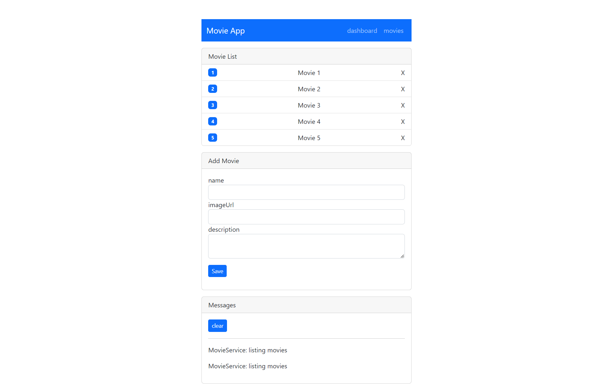

# MovieApp

## How to Start
```shell
npm install
ng serve --open
```

## How to add a Component
```shell
ng g c components_name or ng generate component components_name
```

## How to add a Service
```shell
ng g s services_name or ng generate service services_name
```

## How to add a Routing
```shell
ng g m app-routing --flat --module=app or ng generate module app-routing --flat --module=app
```

## Screenshots




